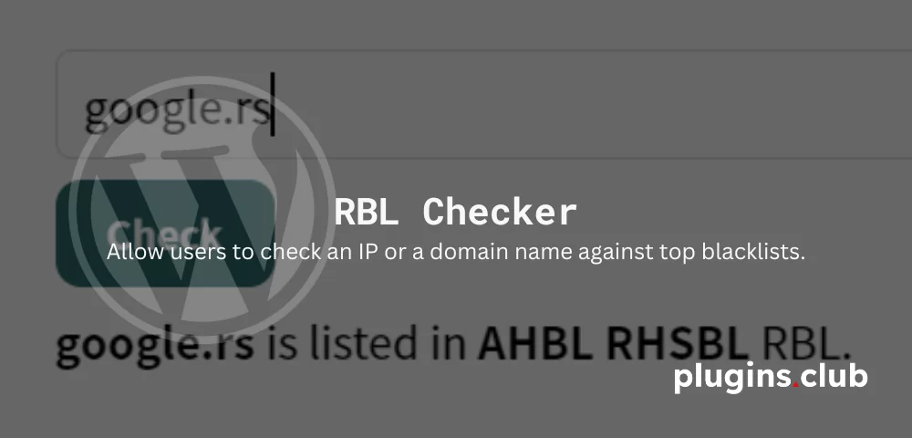
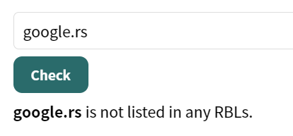
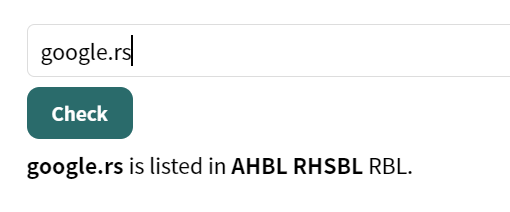

# RBL-Checker

RBL Checker allows anyone to check if an IP address or domain is listed in RBLs. To include the check field on any page, simply add the shortcode `[rbl]`

* * *

 

RBL Checker is also [available as a cPanel plugin](https://cpanelplugins.com/plugins/rbl-check-cpanel-plugin/).
